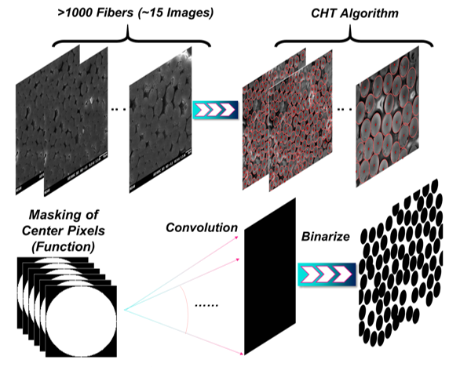

# Composite Image Processing  

This repository contains MATLAB code for detecting and analyzing circular features (e.g., fibers) in composite images. The script demonstrates how to preprocess images, identify round objects, and calculate relevant metrics such as the Fiber Volume Fraction (FVF). This code was used in the paper titled:'Thin, Uniform, and Highly Packed Multifunctional Structural Carbon Fiber Composite Battery Lamina Informed by Solid Polymer Electrolyte Cure Kinetics'

Its a simple code, that employs MATLAB's built in functions in the Image Processing Toolbox, to get the stochastic properties of composites. In my case, an SEM image of CFRP cross-section is used, and I will use it as a showcase for the code running framework.

  

---

## Features  
- Reads and preprocesses an image to enhance detection.  
- Detects circular features based on specified diameter ranges.  
- Visualizes detected circles with their centers marked.  
- Supports manual removal of incorrect or overlapping detections.  
- Calculates the Fiber Volume Fraction (FVF) based on detected features.  

---

## Implementation Details  

### Prerequisites  
- MATLAB installed on your system.  
- Image Processing Toolbox for MATLAB.
I will use an example named 'Sample_11', see the file named `Sample_11.JPG` in the files
Sometimes I prefer to enhance/modify the image before using it with filters. In this case, please see the file named 'Sample_11_Sauna.JPG'

## Usage  

### Steps to Run the Code  
- Open the MATLAB script (`composite_image_processing.m`).  
- Run the script to process the image and visualize the detected features.
- I also tried to divide the code into sections and comment whats the purpose of each seection, so its well-documented inside the code. 

### Key Steps Performed by the Code  

1 Image Preprocessing:  
- Reads the image and crops it to focus on the region of interest.  
- Converts the image to grayscale for better detection accuracy.  

2 Circle Detection:  
- Utilizes `imfindcircles` to detect circular objects within the specified diameter range.  
- Marks detected circles and their centers on the image.  

3 Manual Adjustments:  
- Allows for the removal of incorrectly detected circles to refine results.  

4 Binary Mask and FVF Calculation:  
- Generates a binary mask for the detected circles.  
- Computes the FVF as the fraction of the image area covered by the circles.  

---

## Output  

### The Fibers Centers, Diamteres, Distances    
#### Original Image with Detected Circles  
- Visualizes circles and their centers (`figure1.png`).  
#### Binary Mask  
- Shows the binary representation of detected features (`figure2.png`).  

### Calculated Metrics  
- The Fiber Volume Fraction (FVF) percentage is printed in the MATLAB console.
- The fibers centers, diamteres, distances 
---

---

## Citation  

If you use this code in your research or publications, please cite the associated work:
> Mohamad A. Raja, et al. "Thin, Uniform, and Highly Packed Multifunctional Structural Carbon Fiber Composite Battery Lamina Informed by Solid Polymer Electrolyte Cure Kinetics."  

---

## License  

This project is licensed under the MIT License. See the [LICENSE](LICENSE) file for more details.  

---
